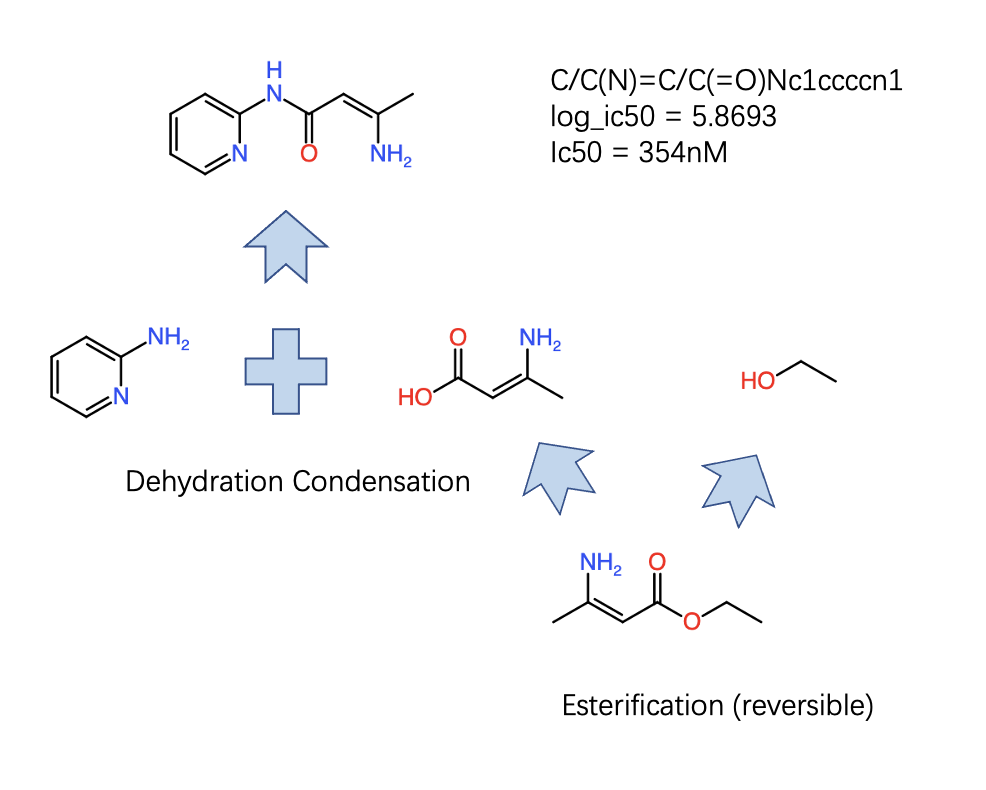

# erbb1_project

This project uses 3 generative models: RXN Generator, JT-VAE and ChemTS, and 1 predictive model: GNN, to generate candidates with good affinity against erbb1 receptor.

To make a long story short: generating a molecule with an optimized property doesn't seem that hard, however, not every proposed molecule candidate can be synthesized. (In fact, most of them can not be synthesized easily) In this work, our main goal is not only generate good drug candidates, but also purpose synthetic pathway that can help us syntheze the molecule in the real world. 

Although we have successfully generated molecules with their synthetic pathway using RXN Generator, we noticed that due to various factors, the desired property is not fully optimized. We therefore conducted similar molecule generation task using both ChemTS and JT-VAE. The results hint us a bit about what could have happened for RXN Generator and show light about how to improve in the future.

An example of RXN Generator generated molecule candidate with synthetic pathway planned during generation:

# Requirements

    conda env create -f requirements.yml

Also, you will need a specific version of theano, which there is no way to install using conda library. Please follow these steps:

1. Download files of the whole project of https://github.com/mkusner/grammarVAE/
2. Theano_master is one subdirectory of the project, please record its path
3. pip install xxxxx/grammarVAE/Theano_master,  where xxxxx is the path of the project

In this case, pip shoule be able to recognize it's a 0.8.0 version.

# Usage

For usage of each model, please refer to the corresponding ipynb file.

# Credits:

1) RXN Generator code is inspired by the orginal work of Dai Hai Nguyen:

https://github.com/haidnguyen0909/rxngenerator

https://arxiv.org/pdf/2106.03394

2) JT-VAE is created by Wengong Jin:
https://arxiv.org/pdf/1802.04364.pdf

The implementation of JT-VAE is inspired by:
https://github.com/Bibyutatsu/FastJTNNpy3

3) ChemTS is a molecule generator created by Yang et al. in 2017:
https://arxiv.org/abs/1710.00616

4) GNN predictive model is inspired by Tsubaki et al.'s work:

https://academic.oup.com/bioinformatics/article/35/2/309/5050020?login=true

https://github.com/masashitsubaki/molecularGNN_smiles

