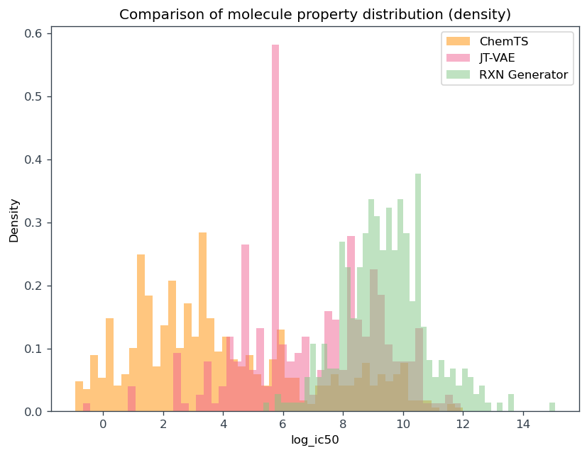

# erbb1_project

This project uses 3 generative models: RXN Generator, JT-VAE and ChemTS, and 1 predictive model: GNN, to generate candidates with good affinity against erbb1 receptor.

# Requirements

    conda env create -f environment.yml

Also, you will need a specific version of theano, which there is no way to install using conda library. Please follow these steps:

1. Download files of the whole project of https://github.com/mkusner/grammarVAE/
2. Theano_master is one subdirectory of the project, please record its path
3. pip install xxxxx/grammarVAE/Theano_master,  where xxxxx is the path of the project

In this case, pip shoule be able to recognize it's a 0.8.0 version.

# Usage

For usage of each model, please refer to the corresponding ipynb file.

# Credits:

RXN Generator code is inspired by the orginal work of Dai Hai Nguyen:

https://github.com/haidnguyen0909/rxngenerator
https://arxiv.org/pdf/2106.03394

JT-VAE is created by Wengong Jin:
https://arxiv.org/pdf/1802.04364.pdf

The implementation of JT-VAE is inspired by:
https://github.com/Bibyutatsu/FastJTNNpy3

ChemTS is a molecule generator created by Yang et al. in 2017:
https://arxiv.org/abs/1710.00616

GNN predictive model is inspired by Tsubaki et al.'s work:

https://academic.oup.com/bioinformatics/article/35/2/309/5050020?login=true
https://github.com/masashitsubaki/molecularGNN_smiles

All modifications and other code are created by: Jinzhe Zhang
